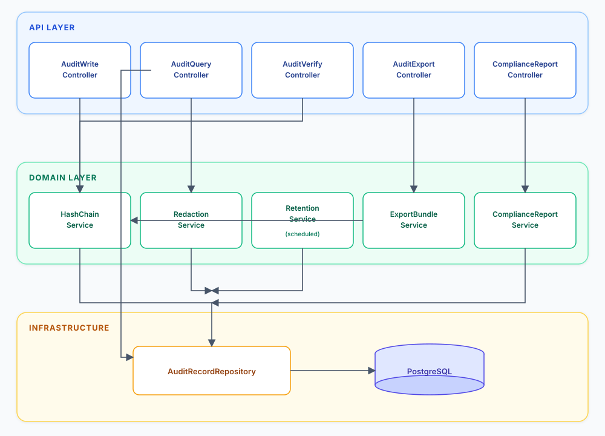
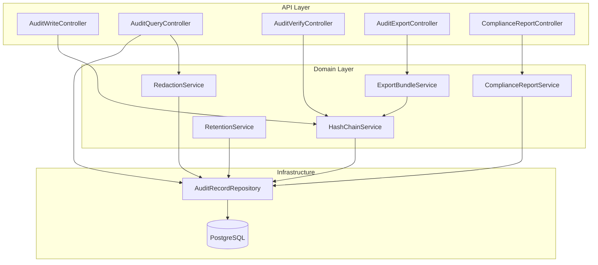
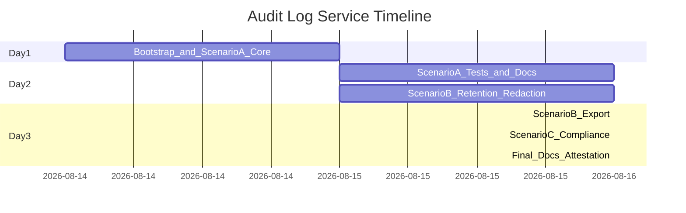

# Audit Log Service — Implementation Plan

## Context

This is a **greenfield** project. Stack: **Java 21 + Spring Boot 3 + PostgreSQL 16**, with Gradle, Flyway migrations, JUnit 5, Testcontainers, and SpringDoc OpenAPI.

The assignment evaluates **engineering judgment + AI-assisted execution**, not just working code. Every scenario needs: decomposition notes, tests, and documented trade-offs in the repo.

---

## High-Level Architecture



<details>
<summary>Mermaid source</summary>



</details>

---

## Repository Layout

```
audit-log-service/
├── ATTESTATION.md
├── README.md                          # setup + run instructions
├── docs/
│   ├── ARCHITECTURE.md                # components, data model, hash design
│   ├── SCENARIO_A.md                  # decomposition + validation
│   ├── SCENARIO_B.md                  # retention/redaction design + trade-offs
│   ├── SCENARIO_C.md                  # clarified requirement + scope boundary
│   ├── AI_USAGE_LOG.md                # prompt traceability
│   └── ENGINEERING_SUMMARY.md         # final rationale, risks, limitations
├── docker-compose.yml                 # PostgreSQL for local dev
├── build.gradle.kts
├── settings.gradle.kts
├── gradlew / gradlew.bat
└── src/
    ├── main/java/com/auditlog/
    │   ├── AuditLogApplication.java
    │   ├── api/                       # REST controllers + DTOs
    │   ├── domain/                    # services, models, hash logic
    │   ├── persistence/               # JPA entities, repositories
    │   └── config/                    # security, Jackson, OpenAPI
    ├── main/resources/
    │   ├── application.yml
    │   └── db/migration/              # Flyway V1..Vn
    └── test/java/                     # unit + integration (Testcontainers)
```

---

## Core Design Decisions (document in ARCHITECTURE.md)

| Decision | Choice | Rationale |
|----------|--------|-----------|
| Clocks | **Dual:** client `occurredAt` + server `recordedAt` (both hashed) | PDF allows either; both preserve event time and ingest time. Query `from`/`to` on `occurredAt`; retention on `recordedAt` |
| Hash algorithm | **SHA-256** over canonical JSON | Industry standard, built into Java `MessageDigest` |
| Chain scope | **Global sequential chain** (single monotonic `sequence` per record) | Simplest tamper detection; every record links to predecessor |
| Genesis value | Constant `000...000` (64 hex zeros) | Explicit, verifiable first-link |
| Canonicalization | Sorted JSON keys, UTF-8, no whitespace; payload as `JsonNode` | Deterministic re-hash on verify; avoid `Double` vs int |
| Storage | PostgreSQL `JSONB` for payload | Queryable + structured redaction |
| Append-only enforcement | No update/delete repo methods; trigger rejects hashed-column writes for the **app role**; `postgres` superuser can still UPDATE for the assigned tamper demo | API + DB guardrails without blocking §5 A validation |

### Hash Chain Formula

For record at sequence `n`:

```
contentHash = SHA-256(canonical({
  actorId, eventType, occurredAt, payload, previousHash,
  recordedAt, resourceId, resourceType, sequence
}))
previousHash = contentHash of record (n-1), or GENESIS for n=1
```

**Canonical JSON (frozen for `HashChainService`):**

- Jackson: recursively sorted object keys, no pretty print, `WRITE_DATES_AS_TIMESTAMPS: false`.
- `Instant` → `Instant.toString()` (ISO-8601 with `Z`).
- Hash payload as `JsonNode` (do not round-trip through `Map<String,Object>` / `Double`).
- Missing/null payload → `{}`; payload must be a JSON object.
- Golden unit test: known canonical object → known SHA-256 hex (computed outside the codebase).

Verification walks records ordered by `sequence ASC`, recomputes each `contentHash`, checks `previousHash` linkage, and stops at first violation. Empty chain: `intact: true`, `totalRecords: 0`. Walk is O(n); no checkpoints in this prototype.

Use a **pessimistic lock** (`pg_advisory_xact_lock` or `SELECT ... FOR UPDATE` on a chain-head row) when appending so two writers cannot share `previousHash`.

---

## Scenario A — Core Audit Log Service

### A1. Data Model (`V1__create_audit_records.sql`)

```sql
CREATE TABLE audit_records (
  id            BIGSERIAL PRIMARY KEY,
  sequence_num  BIGINT NOT NULL UNIQUE,          -- chain order
  event_type    VARCHAR(100) NOT NULL,
  actor_id      VARCHAR(255) NOT NULL,
  resource_type VARCHAR(100) NOT NULL,
  resource_id   VARCHAR(255) NOT NULL,
  payload       JSONB NOT NULL DEFAULT '{}',
  occurred_at   TIMESTAMPTZ NOT NULL,             -- client: when the event occurred
  recorded_at   TIMESTAMPTZ NOT NULL,             -- server: when this service accepted it
  content_hash  CHAR(64) NOT NULL,
  previous_hash CHAR(64) NOT NULL
);

CREATE INDEX idx_audit_actor ON audit_records(actor_id);
CREATE INDEX idx_audit_resource ON audit_records(resource_type, resource_id);
CREATE INDEX idx_audit_event_type ON audit_records(event_type);
CREATE INDEX idx_audit_occurred_at ON audit_records(occurred_at);
CREATE INDEX idx_audit_recorded_at ON audit_records(recorded_at);
```

Use a **pessimistic lock** (`pg_advisory_xact_lock` or `SELECT ... FOR UPDATE` on a chain-head row) when appending to prevent concurrent write race conditions on `previousHash`.

**Append-only enforcement:** no update/delete repository methods, no mapped `PUT`/`DELETE`, and hashed columns mapped as non-updatable.

**Append-only vs assigned tamper demo:** a Flyway trigger rejecting UPDATE/DELETE of hashed columns must target the **application** DB role only, because the §5 A validation script requires a privileged role to still rewrite a row via SQL. Scenario B archive/redaction never rewrites hashed payload — only `status` / overlay rows.

### A2. REST API

| Method | Path | Purpose |
|--------|------|---------|
| `POST` | `/audit/events` | Append event; returns `id`, `sequence`, `contentHash`, `occurredAt`, `recordedAt` |
| `GET` | `/audit/events` | Filter + paginate |
| `GET` | `/audit/verify` | Walk chain; report integrity |
| `POST` | `/auth/token` | Prototype only: OAuth 2.0 client-credentials JWT |

**Write request body:**

```json
{
  "eventType": "USER_LOGIN",
  "actorId": "user-123",
  "resourceType": "SESSION",
  "resourceId": "sess-abc",
  "occurredAt": "2026-08-14T11:30:00Z",
  "payload": { "ip": "10.0.0.1" }
}
```

`occurredAt` is required. Server sets `recordedAt` at persist. Reject if `occurredAt` is more than 5 minutes after `recordedAt`. Arbitrarily old `occurredAt` is allowed (async/offline).

**Query params:** `actorId`, `resourceType`, `resourceId`, `eventType`, `from`, `to` (inclusive on **`occurredAt`**), optional `recordedFrom`/`recordedTo` (inclusive on **`recordedAt`**), `page`, `size` (Spring Data `Pageable`, default size 50, max 200).

**Verify response:**

```json
{
  "intact": false,
  "totalRecords": 42,
  "firstViolation": {
    "sequence": 7,
    "recordId": 7,
    "violationType": "CONTENT_HASH_MISMATCH",
    "expectedHash": "...",
    "actualHash": "..."
  }
}
```

Violation types: `CONTENT_HASH_MISMATCH`, `PREVIOUS_HASH_BREAK`, `SEQUENCE_GAP`.

Empty chain (JWT, no rows): `{ "intact": true, "totalRecords": 0 }` with no `firstViolation`.

### A3. Implementation Tasks (ordered)

1. **Bootstrap** — Gradle, Docker Compose, Flyway V1, health
2. **Security** — API keys + JWT `POST /auth/token`
3. **`CanonicalJson` + `HashChainService`** — canonical serialization, SHA-256, genesis, golden vector
4. **`AuditWriteService`** — transactional append; advisory lock before reading the head
5. **`AuditQueryService`** — optional filters; paging clamped to 200
6. **`AuditVerifyService`** — keyset-paged chain walk, first-violation reporting, empty chain intact
7. **Controllers + validation** — `@Valid` DTOs, unknown fields rejected, single error envelope
8. **OpenAPI** — SpringDoc at `/swagger-ui.html` (bearer + apiKey schemes)
9. **README evaluator script** — write (API key) → query → verify (JWT) → SQL tamper → verify break

### A4. Tests (Scenario A validation script)

| Test | Type | What it proves |
|------|------|----------------|
| Append creates valid chain | Integration | Write 3 events; verify returns intact |
| Concurrent writes | Integration | 10 parallel POSTs; chain still intact |
| Filter combinations | Integration | Each filter param works alone and combined |
| Pagination | Integration | Stable ordering by `sequence_num` |
| Hash unit tests | Unit | Known canonical object → known hex; genesis link |
| Empty chain verify | Integration | JWT `/audit/verify` → intact, totalRecords 0 |
| Tamper detection | Integration | Superuser/`@Sql` UPDATEs `payload`; verify reports `CONTENT_HASH_MISMATCH` at that sequence |

**Manual validation flow** (README, implement with Scenario A APIs):

1. `POST /audit/events` with `X-API-Key: als_ingest_dev_key_do_not_use_in_prod` (several events)
2. `GET /audit/events` with the same key and a filter
3. `POST /auth/token` as `ops-admin`; `GET /audit/verify` with Bearer → `intact: true`
4. Superuser tamper (app role must not be able to do this):
   `docker compose exec postgres psql -U auditlog -d auditlog -c "UPDATE audit_records SET payload = '{\"tampered\":true}' WHERE sequence_num = 2;"`
5. `GET /audit/verify` with Bearer → `intact: false`, `firstViolation.sequence` = 2, `CONTENT_HASH_MISMATCH`

---

## Scenario B — Retention, Redaction, Bulk Export

### B1. Retention Policy

**Design:** Soft archive — records are **never physically removed** from the chain. After configurable retention window (`audit.retention.days`, default 365), a scheduled job marks records as `ARCHIVED` where **`recorded_at`** is older than the window (ingest time, so a backdated `occurredAt` cannot keep a row hot).

**Schema extension** (`V2__retention_and_redaction.sql`):

```sql
ALTER TABLE audit_records ADD COLUMN status VARCHAR(20) NOT NULL DEFAULT 'ACTIVE';
ALTER TABLE audit_records ADD COLUMN archived_at TIMESTAMPTZ;
ALTER TABLE audit_records ADD COLUMN has_redactions BOOLEAN NOT NULL DEFAULT FALSE;

CREATE TABLE audit_redactions (
  id               BIGSERIAL PRIMARY KEY,
  audit_record_id  BIGINT NOT NULL REFERENCES audit_records(id),
  field_path       VARCHAR(255) NOT NULL,
  redacted_at      TIMESTAMPTZ NOT NULL,
  redacted_by      VARCHAR(255) NOT NULL,
  reason           VARCHAR(500)
);
```

- Default queries exclude `status = 'ARCHIVED'` unless `includeArchived=true`
- **Verify endpoint:** walks **all** records (ACTIVE + ARCHIVED) in sequence order — chain stays intact, no false positives
- Optional: `POST /audit/admin/archive` (or cron) to run retention sweep; log count archived

**Trade-off to document:** Soft archive preserves chain integrity at the cost of storage growth. Hard delete would break the chain unless tombstone records are inserted (scoped out unless time permits).

### B2. Structured Redaction (key engineering problem)

**Design: Immutable hash + redaction overlay**

The hash chain covers the **original record at write time**. Redaction never mutates fields that participate in `contentHash`.

```
audit_redactions (
  id, audit_record_id, field_path,        -- e.g. "accountNumber"
  redacted_at, redacted_by, reason
)
```

- `contentHash` computed once at write from original payload
- `POST /audit/events/{id}/redact` accepts `{ "fieldPaths": ["accountNumber"], "reason": "GDPR" }`
- Query/export APIs apply a **redaction view**: replace values at `fieldPath` with `"[REDACTED]"`
- Verify uses **stored original payload** + stored hashes → chain remains valid after redaction
- Add flag on record: `has_redactions BOOLEAN`

**Alternative considered and rejected:** Recomputing hash after redaction — breaks tamper evidence for original value. Document this explicitly in SCENARIO_B.md.

**Tests:**

- Redact field → verify still intact
- Query returns redacted payload
- Export bundle includes redaction metadata
- Direct DB tamper still detected

### B3. Bulk Export

**Endpoint:** `GET /audit/export?actorId=...` or `?resourceId=...` (+ optional `resourceType`)

**Bundle format (JSON file download):**

```json
{
  "exportVersion": "1.0",
  "exportedAt": "...",
  "filter": { "actorId": "user-123" },
  "genesisHash": "000...000",
  "records": [
    {
      "sequence": 1,
      "eventType": "...",
      "occurredAt": "...",
      "recordedAt": "...",
      "contentHash": "...",
      "previousHash": "...",
      "payload": { },
      "redactedFields": ["accountNumber"]
    }
  ],
  "bundleHash": "SHA-256 of canonical exportVersion+exportedAt+filter+genesisHash+records"
}
```

**Export is a subsequence, not a mini-chain.** Filter by `actorId` / `resourceId` returns a sparse slice of the **global** sequence. `previousHash` often points at a row **not** in the file. The PDF requires proving records **have not been altered since export**, not that a recipient can replay `/audit/verify`.

`ExportVerifier` (standalone Java, documented in README):

1. Recompute `bundleHash` over canonical metadata + records. Mismatch → bundle tampered since export.
2. For each record with **empty** `redactedFields`, recompute `contentHash` from the payload in the file and compare to the copied server hash.
3. Do **not** recompute `contentHash` from a redacted payload (hashes cover original JSONB).
4. Do **not** fail because sequence numbers have gaps.

Full chain integrity remains `GET /audit/verify` on the service.

---

## Scenario C — Compliance Reporting (Ambiguous Requirement)

### C1. Requirement Clarification (before coding — document in SCENARIO_C.md)

**Original (ambiguous):** *"Regulators need to be able to audit access to client account data."*

**Clarified requirement statement:**

> Provide a read-only compliance report and export that lists all audit events where `resourceType = CLIENT_ACCOUNT` and `eventType` indicates data access (e.g., `ACCOUNT_VIEWED`, `ACCOUNT_UPDATED`, `PERMISSION_GRANTED`), filterable by account (`resourceId`), actor, and time range on **`occurredAt`**, with immutable evidence that the report data matches the tamper-evident audit chain at report generation time.

**Ambiguities identified:**

| Ambiguity | Assumption / question for product |
|-----------|-----------------------------------|
| Which events count as "access"? | Defined enum set: `ACCOUNT_VIEWED`, `ACCOUNT_UPDATED`, `STATEMENT_DOWNLOADED`, `PERMISSION_GRANTED` |
| Which resources are "client account data"? | `resourceType = CLIENT_ACCOUNT` |
| Report format for regulators? | JSON + CSV download |
| Real-time vs point-in-time? | Point-in-time snapshot with `reportGeneratedAt` + chain head hash |
| Authentication / RBAC for regulators? | JWT with `audit.compliance` in this prototype; corporate SSO/IdP is production |

**Scoped out (with rationale):** Corporate SSO / JWKS IdP, scheduled regulatory filing, PDF formatting, multi-tenant isolation — document as production next steps. Prototype mints local JWTs via `POST /auth/token`.

### C2. Implementation

| Method | Path | Purpose |
|--------|------|---------|
| `GET` | `/audit/compliance/access-report` | Filtered report with summary stats |
| `GET` | `/audit/compliance/access-report/export` | CSV/JSON download |

**Report response includes:**

- `reportId`, `generatedAt`, `chainHeadHash` (latest `contentHash` at generation time)
- `summary`: total access events, unique actors, date range
- `events`: paginated access events (redaction-aware)
- `verificationHint`: how to cross-check via `/audit/verify` and export bundle

**Tests:** Seed CLIENT_ACCOUNT access events; assert report filters correctly; assert non-access events excluded; assert chain head hash present.

---

## Cross-Cutting Concerns

### Security (hybrid API keys + JWT)

The assignment does not specify auth. This layer is **who may call which endpoint**. Scenario C still scopes out corporate SSO; callers in the prototype use API keys or locally minted JWTs. Production sits behind TLS and an enterprise IdP.

**Threats:** anonymous write/query of the chain; an ingest client redacting or archiving; secrets in logs/OpenAPI; brute force on the token endpoint. Auth does not replace dual-clock evidence (`recordedAt`).

**API keys** (machine ingest): header `X-API-Key`. Secrets stored hashed (SHA-256 of key + pepper). Prototype keys in `audit.security.api-keys` (config, not a table). Each key has `clientId` + scopes.

**JWT** (ops / compliance): header `Authorization: Bearer`. Prototype: `POST /auth/token` (OAuth 2.0 client credentials: `client_id` + `client_secret`) issues an HMAC-signed JWT (~15 min). Production: corporate IdP + JWKS; no local token endpoint.

Spring Security maps both to the same authorities.

| Scope | Meaning |
|-------|---------|
| `audit.write` | Append events |
| `audit.read` | Query, export, verify |
| `audit.admin` | Redact, retention sweep (implies read) |
| `audit.compliance` | Compliance report/export |

| Path | API key | JWT | Required scope |
|------|---------|-----|----------------|
| `POST /audit/events` | yes (primary) | yes | `audit.write` |
| `GET /audit/events` | yes | yes | `audit.read` |
| `GET /audit/export` | yes | yes | `audit.read` |
| `GET /audit/verify` | no | yes | `audit.read` |
| `POST /audit/events/{id}/redact` | no | yes | `audit.admin` |
| `POST /audit/admin/archive` | no | yes | `audit.admin` |
| `GET /audit/compliance/*` | no | yes | `audit.compliance` |
| `POST /auth/token` | n/a | n/a | Public, strict rate limit |
| `/actuator/health` | n/a | n/a | Public |
| `/swagger-ui.html`, `/v3/api-docs` | n/a | n/a | Open in local; deny in `prod` |

Verify, admin, and compliance are JWT-only so a leaked ingest key cannot archive, redact, or probe integrity.

Also: TLS in production (reverse proxy; local HTTP OK). Rate limit per API-key `clientId` / JWT `sub`; token endpoint tighter (e.g. 10/min). Never log `Authorization` or `X-API-Key`. Security headers (`nosniff`, deny framing). Input validation, 64KB payload, parameterized SQL, no update/delete APIs. 401/403 use the standard error envelope; no key-enumeration messages.

### Error Handling

Standard error envelope: `{ "error": "...", "code": "...", "timestamp": "..." }` via `@ControllerAdvice`. Same shape for 401/403; do not reveal whether a key or client id exists.

### Observability

- Structured logging (append, verify result, archive sweep)
- Micrometer metrics: `audit.events.written`, `audit.verify.duration`, `audit.chain.intact`

---

## Documentation & Submission Deliverables

| Deliverable | Location | When |
|-------------|----------|------|
| Attestation | `ATTESTATION.md` | Final |
| Setup instructions | `README.md` | After bootstrap |
| Architecture overview | `docs/ARCHITECTURE.md` | After Scenario A |
| Scenario write-ups | `docs/SCENARIO_*.md` | Per scenario |
| AI usage log | `docs/AI_USAGE_LOG.md` | Continuously during dev |
| Engineering summary | `docs/ENGINEERING_SUMMARY.md` | Final |
| OpenAPI spec | Auto-generated + linked in README | After APIs stable |

**AI usage log format** (append as you work):

```
## [Date] Task: Hash chain service
- Prompt: ...
- Accepted: canonical JSON approach
- Modified: switched to SHA-256 from SHA-512 for simplicity
- Rejected: per-resource sub-chains (harder verify/export)
- Rationale: ...
```

---

## Implementation Sequence (2–3 day timeline)

Progress against this plan is tracked in `docs/ENGINEERING_SUMMARY.md`, not here.



### Scenario A — core service

- Project scaffold, Docker Compose, Flyway V1, hybrid auth
- Hash chain service + write/query/verify APIs
- Integration tests including the assigned SQL tamper detection

### Scenario B — retention, redaction, export

- V2: `status`, `archived_at`, `has_redactions`, `audit_redactions`
- Archive/redact (never rewrite hashed payload); export subsequence + `ExportVerifier`
- App-role vs owner-role split, then the append-only trigger

### Then Scenario C + submission

- Compliance report; seed 2–3 `CLIENT_ACCOUNT` access events
- README, AI log, engineering summary; `ATTESTATION.md` date at the end
- Do **not** add `Interview_Assignment_Audit_Log_Service.pdf` to the shared repo (§0.2 confidential)
- Quality gate: `./gradlew test`. No GitHub Actions unless time remains
- Keep write/query/verify in **services** (live defense: new filter or event type)

---

## Key Risks and Mitigations

| Risk | Mitigation |
|------|------------|
| Concurrent append breaks chain | DB advisory lock or chain-head row lock |
| Non-deterministic JSON breaks verify | Frozen serializer (sorted keys, `JsonNode` payload, Instant `toString`); golden hex |
| Redaction breaks hash chain | Never mutate hashed fields; overlay-only |
| Retention causes false verify failures | Soft archive only; verify includes archived rows |
| App-role trigger blocks assigned SQL tamper | Trigger for app role only; README uses `postgres` superuser |
| Export filter looks like a broken mini-chain | `bundleHash` + subsequence rules; gaps are not a verify failure |
| Scope creep on Scenario C | Document clarified requirement + explicit scope boundary |

---

## Live Defense Preparation

- Keep Docker Compose one-command startup: `./gradlew bootRun` + `docker compose up -d`
- Be ready to explain hash canonicalization, redaction scheme, and retention trade-offs
- Expect a small live change (e.g., new filter param or event type) — keep code modular in services, not controllers
