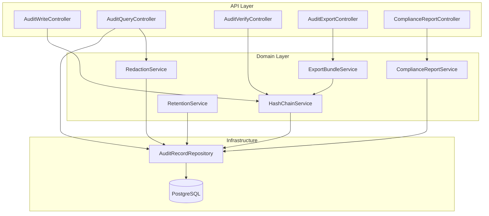
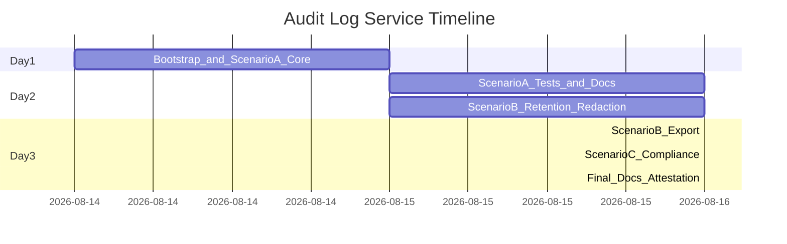

# Audit Log Service — Implementation Plan

## Context

This is a **greenfield** project. Stack: **Java 21 + Spring Boot 3 + PostgreSQL 16**, with Maven, Flyway migrations, JUnit 5, Testcontainers, and SpringDoc OpenAPI.

The assignment evaluates **engineering judgment + AI-assisted execution**, not just working code. Every scenario needs: decomposition notes, tests, and documented trade-offs in the repo.

---

## High-Level Architecture



---

## Repository Layout

```
audit-log-service/
├── ATTESTATION.md
├── README.md                          # setup + run instructions
├── docs/
│   ├── ARCHITECTURE.md                # components, data model, hash design
│   ├── SCENARIO_A.md                  # decomposition + validation
│   ├── SCENARIO_B.md                  # retention/redaction design + trade-offs
│   ├── SCENARIO_C.md                  # clarified requirement + scope boundary
│   ├── AI_USAGE_LOG.md                # prompt traceability
│   └── ENGINEERING_SUMMARY.md         # final rationale, risks, limitations
├── docker-compose.yml                 # PostgreSQL for local dev
├── pom.xml
└── src/
    ├── main/java/com/auditlog/
    │   ├── AuditLogApplication.java
    │   ├── api/                       # REST controllers + DTOs
    │   ├── domain/                    # services, models, hash logic
    │   ├── persistence/               # JPA entities, repositories
    │   └── config/                    # security, Jackson, OpenAPI
    ├── main/resources/
    │   ├── application.yml
    │   └── db/migration/              # Flyway V1..Vn
    └── test/java/                     # unit + integration (Testcontainers)
```

---

## Core Design Decisions (document in ARCHITECTURE.md)

| Decision | Choice | Rationale |
|----------|--------|-----------|
| Timestamp | **Server-assigned** (`Instant` at persist time) | Prevents backdating/tampering via caller; document in API spec |
| Hash algorithm | **SHA-256** over canonical JSON | Industry standard, built into Java `MessageDigest` |
| Chain scope | **Global sequential chain** (single monotonic `sequence` per record) | Simplest tamper detection; every record links to predecessor |
| Genesis value | Constant `000...000` (64 hex zeros) | Explicit, verifiable first-link |
| Canonicalization | Sorted JSON keys, UTF-8, no whitespace | Deterministic re-hash on verify |
| Storage | PostgreSQL `JSONB` for payload | Queryable + structured redaction |
| Append-only enforcement | No update/delete repository methods; DB trigger optional | API + persistence layer guardrails |

### Hash Chain Formula

For record at sequence `n`:

```
contentHash = SHA-256(canonical({
  sequence, eventType, actorId, resourceType, resourceId,
  payload, timestamp, previousHash
}))
previousHash = contentHash of record (n-1), or GENESIS for n=1
```

Verification walks records ordered by `sequence ASC`, recomputes each `contentHash`, checks `previousHash` linkage, and stops at first violation.

---

## Scenario A — Core Audit Log Service

### A1. Data Model (`V1__create_audit_records.sql`)

```sql
CREATE TABLE audit_records (
  id            BIGSERIAL PRIMARY KEY,
  sequence_num  BIGINT NOT NULL UNIQUE,          -- chain order
  event_type    VARCHAR(100) NOT NULL,
  actor_id      VARCHAR(255) NOT NULL,
  resource_type VARCHAR(100) NOT NULL,
  resource_id   VARCHAR(255) NOT NULL,
  payload       JSONB NOT NULL DEFAULT '{}',
  timestamp     TIMESTAMPTZ NOT NULL,
  content_hash  CHAR(64) NOT NULL,
  previous_hash CHAR(64) NOT NULL,
  created_at    TIMESTAMPTZ NOT NULL DEFAULT now()
);

CREATE INDEX idx_audit_actor ON audit_records(actor_id);
CREATE INDEX idx_audit_resource ON audit_records(resource_type, resource_id);
CREATE INDEX idx_audit_event_type ON audit_records(event_type);
CREATE INDEX idx_audit_timestamp ON audit_records(timestamp);
```

Use a **pessimistic lock** (`SELECT ... FOR UPDATE` on a chain-head row or advisory lock) when appending to prevent concurrent write race conditions on `previousHash`.

### A2. REST API

| Method | Path | Purpose |
|--------|------|---------|
| `POST` | `/audit/events` | Append event; returns `id`, `sequence`, `contentHash`, `timestamp` |
| `GET` | `/audit/events` | Filter + paginate |
| `GET` | `/audit/verify` | Walk chain; report integrity |

**Write request body:**

```json
{
  "eventType": "USER_LOGIN",
  "actorId": "user-123",
  "resourceType": "SESSION",
  "resourceId": "sess-abc",
  "payload": { "ip": "10.0.0.1" }
}
```

**Query params:** `actorId`, `resourceType`, `resourceId`, `eventType`, `from`, `to`, `page`, `size` (Spring Data `Pageable`, default size 50, max 200).

**Verify response:**

```json
{
  "intact": false,
  "totalRecords": 42,
  "firstViolation": {
    "sequence": 7,
    "recordId": 7,
    "violationType": "CONTENT_HASH_MISMATCH",
    "expectedHash": "...",
    "actualHash": "..."
  }
}
```

Violation types: `CONTENT_HASH_MISMATCH`, `PREVIOUS_HASH_BREAK`, `SEQUENCE_GAP`.

### A3. Implementation Tasks (ordered)

1. **Bootstrap** — Spring Boot project, Docker Compose Postgres, Flyway, health check
2. **`HashChainService`** — canonical JSON serialization, SHA-256, genesis handling
3. **`AuditWriteService`** — transactional append with sequence assignment + locking
4. **`AuditQueryService`** — dynamic JPA Specification / native query for filters
5. **`AuditVerifyService`** — full-chain walk with detailed first-violation reporting
6. **Controllers + validation** — `@Valid` DTOs, `@ControllerAdvice` error handling
7. **OpenAPI** — SpringDoc at `/swagger-ui.html`

### A4. Tests (Scenario A validation script)

| Test | Type | What it proves |
|------|------|----------------|
| Append creates valid chain | Integration | Write 3 events; verify returns intact |
| Concurrent writes | Integration | 10 parallel POSTs; chain still intact |
| Filter combinations | Integration | Each filter param works alone and combined |
| Pagination | Integration | Stable ordering by `sequence_num` |
| Tamper detection | Integration | `@Sql` or test helper UPDATEs `payload` in DB; verify reports break |
| Hash unit tests | Unit | Known input → known hash; genesis link |

**Manual validation flow** (document in README):

1. POST several events
2. GET with filters
3. GET `/audit/verify` → intact
4. Direct SQL tamper on a row
5. GET `/audit/verify` → broken with sequence + violation type

---

## Scenario B — Retention, Redaction, Bulk Export

### B1. Retention Policy

**Design:** Soft archive — records are **never physically removed** from the chain. After configurable retention window (`audit.retention.days`, default 365), a scheduled job marks records as `ARCHIVED`.

**Schema extension** (`V2__retention_and_redaction.sql`):

```sql
ALTER TABLE audit_records ADD COLUMN status VARCHAR(20) NOT NULL DEFAULT 'ACTIVE';
ALTER TABLE audit_records ADD COLUMN archived_at TIMESTAMPTZ;
```

- Default queries exclude `status = 'ARCHIVED'` unless `includeArchived=true`
- **Verify endpoint:** walks **all** records (ACTIVE + ARCHIVED) in sequence order — chain stays intact, no false positives
- Optional: `POST /audit/admin/archive` (or cron) to run retention sweep; log count archived

**Trade-off to document:** Soft archive preserves chain integrity at the cost of storage growth. Hard delete would break the chain unless tombstone records are inserted (scoped out unless time permits).

### B2. Structured Redaction (key engineering problem)

**Design: Immutable hash + redaction overlay**

The hash chain covers the **original record at write time**. Redaction never mutates fields that participate in `contentHash`.

```
audit_redactions (
  id, audit_record_id, field_path,        -- e.g. "accountNumber"
  redacted_at, redacted_by, reason
)
```

- `contentHash` computed once at write from original payload
- `POST /audit/events/{id}/redact` accepts `{ "fieldPaths": ["accountNumber"], "reason": "GDPR" }`
- Query/export APIs apply a **redaction view**: replace values at `fieldPath` with `"[REDACTED]"`
- Verify uses **stored original payload** + stored hashes → chain remains valid after redaction
- Add flag on record: `has_redactions BOOLEAN`

**Alternative considered and rejected:** Recomputing hash after redaction — breaks tamper evidence for original value. Document this explicitly in SCENARIO_B.md.

**Tests:**

- Redact field → verify still intact
- Query returns redacted payload
- Export bundle includes redaction metadata
- Direct DB tamper still detected

### B3. Bulk Export

**Endpoint:** `GET /audit/export?actorId=...` or `?resourceId=...` (+ optional `resourceType`)

**Bundle format (JSON file download):**

```json
{
  "exportVersion": "1.0",
  "exportedAt": "...",
  "filter": { "actorId": "user-123" },
  "genesisHash": "000...000",
  "records": [
    {
      "sequence": 1,
      "eventType": "...",
      "contentHash": "...",
      "previousHash": "...",
      "payload": { },
      "redactedFields": ["accountNumber"]
    }
  ],
  "bundleHash": "SHA-256 of canonical records array + metadata"
}
```

Provide a standalone **`ExportVerifier`** utility (Java class + documented algorithm in README) so a recipient can verify the bundle without running the full service.

---

## Scenario C — Compliance Reporting (Ambiguous Requirement)

### C1. Requirement Clarification (before coding — document in SCENARIO_C.md)

**Original (ambiguous):** *"Regulators need to be able to audit access to client account data."*

**Clarified requirement statement:**

> Provide a read-only compliance report and export that lists all audit events where `resourceType = CLIENT_ACCOUNT` and `eventType` indicates data access (e.g., `ACCOUNT_VIEWED`, `ACCOUNT_UPDATED`, `PERMISSION_GRANTED`), filterable by account (`resourceId`), actor, and time range, with immutable evidence that the report data matches the tamper-evident audit chain at report generation time.

**Ambiguities identified:**

| Ambiguity | Assumption / question for product |
|-----------|-----------------------------------|
| Which events count as "access"? | Defined enum set: `ACCOUNT_VIEWED`, `ACCOUNT_UPDATED`, `STATEMENT_DOWNLOADED`, `PERMISSION_GRANTED` |
| Which resources are "client account data"? | `resourceType = CLIENT_ACCOUNT` |
| Report format for regulators? | JSON + CSV download |
| Real-time vs point-in-time? | Point-in-time snapshot with `reportGeneratedAt` + chain head hash |
| Authentication / RBAC for regulators? | Scoped out; note as production gap |

**Scoped out (with rationale):** SSO integration, scheduled regulatory filing, PDF formatting, multi-tenant isolation — document as production next steps.

### C2. Implementation

| Method | Path | Purpose |
|--------|------|---------|
| `GET` | `/audit/compliance/access-report` | Filtered report with summary stats |
| `GET` | `/audit/compliance/access-report/export` | CSV/JSON download |

**Report response includes:**

- `reportId`, `generatedAt`, `chainHeadHash` (latest `contentHash` at generation time)
- `summary`: total access events, unique actors, date range
- `events`: paginated access events (redaction-aware)
- `verificationHint`: how to cross-check via `/audit/verify` and export bundle

**Tests:** Seed CLIENT_ACCOUNT access events; assert report filters correctly; assert non-access events excluded; assert chain head hash present.

---

## Cross-Cutting Concerns

### Security (production readiness signals)

- Input validation on all DTOs (`@NotBlank`, payload size limit e.g. 64KB)
- No update/delete endpoints for audit records
- SQL injection prevented via JPA parameterized queries
- Optional: Spring Security with API key for admin endpoints (archive, redact) — document as minimal auth layer
- Rate limiting noted as production follow-up

### Error Handling

Standard error envelope: `{ "error": "...", "code": "...", "timestamp": "..." }` via `@ControllerAdvice`.

### Observability

- Structured logging (append, verify result, archive sweep)
- Micrometer metrics: `audit.events.written`, `audit.verify.duration`, `audit.chain.intact`

---

## Documentation & Submission Deliverables

| Deliverable | Location | When |
|-------------|----------|------|
| Attestation | `ATTESTATION.md` | Final |
| Setup instructions | `README.md` | After bootstrap |
| Architecture overview | `docs/ARCHITECTURE.md` | After Scenario A |
| Scenario write-ups | `docs/SCENARIO_*.md` | Per scenario |
| AI usage log | `docs/AI_USAGE_LOG.md` | Continuously during dev |
| Engineering summary | `docs/ENGINEERING_SUMMARY.md` | Final |
| OpenAPI spec | Auto-generated + linked in README | After APIs stable |

**AI usage log format** (append as you work):

```
## [Date] Task: Hash chain service
- Prompt: ...
- Accepted: canonical JSON approach
- Modified: switched to SHA-256 from SHA-512 for simplicity
- Rejected: per-resource sub-chains (harder verify/export)
- Rationale: ...
```

---

## Implementation Sequence (2–3 day timeline)



### Day 1 — Scenario A (MVP)

- Project scaffold, Docker Compose, Flyway V1
- Hash chain service + write/query/verify APIs
- Basic integration tests including tamper detection

### Day 2 — Scenario A polish + Scenario B

- Pagination edge cases, OpenAPI, ARCHITECTURE.md
- Retention (V2 migration, archive job, verify with archived records)
- Redaction overlay + API

### Day 3 — Scenario B export + Scenario C + submission

- Bulk export + bundle verifier
- Compliance report endpoints + SCENARIO_C.md clarification doc
- AI_USAGE_LOG.md, ENGINEERING_SUMMARY.md, ATTESTATION.md
- End-to-end manual validation script in README

---

## Key Risks and Mitigations

| Risk | Mitigation |
|------|------------|
| Concurrent append breaks chain | DB advisory lock or chain-head row lock |
| Non-deterministic JSON breaks verify | Canonical serializer with sorted keys; golden tests |
| Redaction breaks hash chain | Never mutate hashed fields; overlay-only |
| Retention causes false verify failures | Soft archive only; verify includes archived rows |
| Scope creep on Scenario C | Document clarified requirement + explicit scope boundary |

---

## Live Defense Preparation

- Keep Docker Compose one-command startup: `./mvnw spring-boot:run` + `docker compose up -d`
- Be ready to explain hash canonicalization, redaction scheme, and retention trade-offs
- Expect a small live change (e.g., new filter param or event type) — keep code modular in services, not controllers
